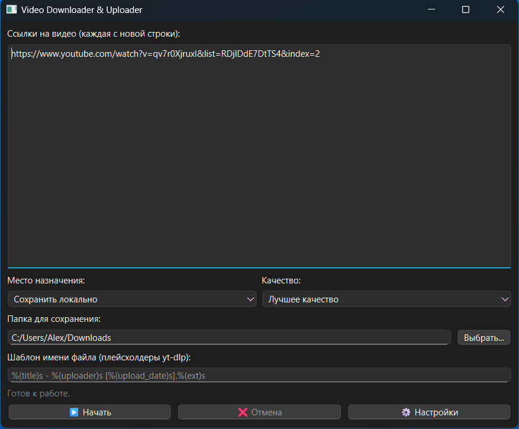

# Video Downloader & Uploader

[](https://www.python.org/)
[](https://www.qt.io/qt-for-python)
[](https://github.com/mr-alex-vas/video-downloader-uploader/actions)
[](https://github.com/mr-alex-vas/video-downloader-uploader/actions)
[](https://opensource.org/licenses/MIT)

# Video Downloader & Uploader (Pro)

**Video Downloader & Uploader** — это многофункциональное десктопное приложение для Windows, разработанное для автоматизации процесса скачивания видео с сотен веб-сайтов и их последующей загрузки в облачные хранилища или локальные папки. Проект демонстрирует применение современных инженерных практик, включая асинхронное программирование, паттерны проектирования и строгие принципы безопасности.

Приложение имеет как интуитивно понятный графический интерфейс (GUI), так и интерфейс командной строки (CLI) для интеграции в скрипты и автоматизации рутинных задач.

---

## 🌟 Ключевые возможности (Features)

| Функция | Описание |
| :--- | :--- |
| **Мультиплатформенное скачивание** | Интеграция с `yt-dlp` обеспечивает поддержку сотен видео-сайтов, включая YouTube, TikTok, Instagram и многие другие. |
| **Гибкая загрузка** | Поддержка **Google Drive**, **Яндекс.Диск** и локального сохранения с возможностью указания конкретной папки назначения. |
| **Продвинутая настройка** | Выбор качества видео/аудио, использование прокси-серверов и гибкие шаблоны для именования файлов. |
| **Асинхронный конвейер** | Скачивание и загрузка выполняются в параллельных асинхронных потоках, что обеспечивает максимальную производительность и отзывчивость интерфейса. |
| **Надежность и отказоустойчивость** | "Предполетные" проверки (Pre-flight checks) валидируют настройки и доступность сервисов *до* начала длительных операций. |
| **Сохранение сессии** | Приложение автоматически сохраняет и загружает состояние интерфейса между запусками, экономя время пользователя. |
| **Безопасная аутентификация** | Использование стандарта **OAuth 2.0** для Google Drive и токенов для Яндекс.Диска. Все ключи и секреты хранятся локально и **никогда** не попадают в код. |
| **Двойной интерфейс (GUI + CLI)** | Полноценный графический интерфейс для интерактивной работы и CLI для автоматизации и скриптинга. |

---

## 🚀 Технологический стек и архитектура

Этот проект был построен с упором на качество, безопасность и расширяемость.

| Категория | Технологии и Принципы |
| :--- | :--- |
| **Язык и среда** | `Python 3.10+` |
| **Графический интерфейс (GUI)** | `PySide6` (официальные биндинги Qt for Python) |
| **Асинхронность** | `asyncio`, `QThreadPool` для выполнения длительных операций в фоновых потоках, что гарантирует отзывчивость GUI. |
| **Скачивание** | `yt-dlp` (самый мощный и поддерживаемый форк youtube-dl) |
| **Облачные API** | `google-api-python-client`, `google-auth-oauthlib` (Google Drive), `yadisk` (Яндекс.Диск) |
| **Конфигурация и безопасность** | `Pydantic` и `Pydantic-settings` для строгой валидации типов и безопасной работы с секретами (`SecretStr`) из `.env` файлов. |
| **Архитектурные паттерны** | **Стратегия (Strategy Pattern)** для реализации модульной и легко расширяемой системы загрузчиков (`UploaderStrategy`). |
| **Тестирование** | **`pytest`**, `pytest-qt`, `pytest-cov`. **98% покрытие кода** тестами, включая юнит-тесты, интеграционные тесты и тесты GUI. |
| **Сборка и дистрибуция** | `PyInstaller` для сборки в один исполняемый `.exe` файл. |
| **Безопасность зависимостей** | `pip-audit` для проактивной проверки уязвимостей в сторонних библиотеках. |
| **Качество кода** | `black`, `ruff`, `SonarQube` для форматирования и статического анализа. |

---

## 📱 Внешний вид приложения



---

## 🛠️ Установка и запуск

#### 1. Клонирование репозитория

```bash
git clone https://github.com/mr-alex-vas/video-downloader-uploader.git
cd video-downloader-uploader
```

#### 2. Создание и активация виртуального окружения

```bash
# Для Windows
python -m venv .venv
.venv\Scripts\activate
```

#### 3. Установка зависимостей

Приложение и все его зависимости устанавливаются одной командой из `pyproject.toml`.

```bash
pip install .
```

Для установки с инструментами для разработки (например, `pytest`, `pyinstaller`) используйте:
```bash
pip install .[dev]
```

#### 4. Настройка аутентификации

При первом запуске приложение создаст файл `.env` для хранения настроек. Вы можете отредактировать его вручную или настроить все через GUI.

- **Для Яндекс.Диска**: Получите OAuth-токен [здесь](https://yandex.ru/dev/disk/poligon/) и вставьте его в окне настроек.
- **Для Google Drive**:
    1. Создайте проект в [Google Cloud Console](https://console.cloud.google.com/).
    2. Включите **Google Drive API**.
    3. Создайте учетные данные типа "OAuth client ID" для "Desktop app".
    4. Скачайте JSON-файл и переименуйте его в `credentials.json`.
    5. Поместите `credentials.json` в корень проекта. При первом запуске процесса откроется браузер для авторизации.

#### 5. Запуск приложения

```bash
# Запуск графического интерфейса (GUI)
vdu-gui
```

```bash
# Запуск интерфейса командной строки (CLI)
vdu-cli --help
```

---

## ✅ Тестирование и качество

Проект имеет **98% покрытие кода тестами**, что гарантирует высокую стабильность и надежность. Для запуска всего набора тестов выполните команду:

```bash
pytest
```

---

## 📦 Сборка приложения

Для сборки приложения в один исполняемый `.exe` файл используется `PyInstaller`.

1.  **Установите зависимости для разработки**:
    ```bash
    pip install .[dev]
    ```

2.  **Запустите сборку**:
    ```bash
    pyinstaller vdu.spec
    ```
    Готовый файл `VideoDownloaderUploader.exe` будет находиться в папке `dist`.

---

## 🤝 Вклад и лицензия

Проект распространяется под лицензией MIT. Сообщения об ошибках и предложения по улучшению приветствуются в разделе **Issues**.
