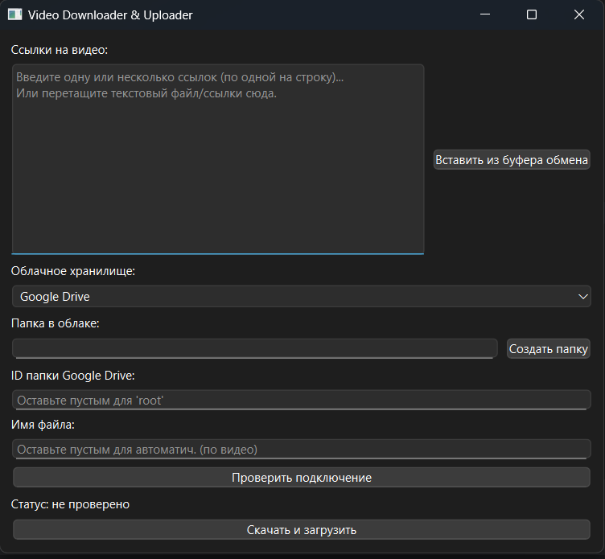

# Video Downloader & Uploader

## Описание

**Video Downloader & Uploader** — современный инструмент для скачивания видео с популярных платформ (YouTube, Vimeo, TikTok и др.) с последующей автоматической загрузкой в облачные хранилища (**Google Drive**, **Yandex.Disk**). Проект ориентирован на удобство, безопасность и расширяемость, идеально подходит для личного и профессионального использования.

## Основные возможности

- **Скачивание видео** с YouTube, TikTok, Instagram Reels и других платформ через yt-dlp.
- **Загрузка в облако**: автоматическая отправка в Google Drive или Яндекс.Диск, поддержка вложенных папок.
- **Гибкая обработка имен файлов**: автогенерация или ручной ввод.
- **Безопасная аутентификация**: OAuth2 для Google Drive, токены для Яндекс.Диска (через .env).
- **Детализированное логирование**: для диагностики и аудита.
- **Модульная архитектура**: легко добавить новые сервисы и расширить функционал.
- **Прогрессбар и информативный GUI**: наглядное отображение статуса операций.
- **Автоматическое удаление временных файлов** после успешной загрузки.

## Cкриншоты



---

## Структура проекта

```
video-downloader-uploader/
├── src/
│   ├── gui.py           # Графический интерфейс (PySide6)
│   ├── downloader.py    # Скачивание видео
│   ├── uploader.py      # Загрузка в облако
│   ├── auth.py          # Аутентификация
│   ├── logger.py        # Логирование
│   └── main.py          # Точка входа
├── tests/
│   └── test_main.py     # Юнит-тесты
├── .env                 # Переменные окружения (токены)
├── requirements.txt     # Зависимости
└── README.md            # Инструкции
```

---

## Быстрый старт

1. **Клонируйте репозиторий:**
   ```sh
   git clone https://github.com/yourusername/video-downloader-uploader.git
   cd video-downloader-uploader
   ```
2. **Установите зависимости:**
   ```sh
   pip install -r requirements.txt
   ```
3. **Создайте файл `.env`** и укажите свои токены Google и Яндекс.Диска.
4. **Запустите GUI:**
   ```sh
   python src/gui.py
   ```
   _или для консольного режима:_
   ```sh
   python src/main.py
   ```

---

## Использование

- Введите ссылку на видео и выберите облако для загрузки.
- Для Google Drive укажите ID папки (или оставьте "root").
- Для Яндекс.Диска настройте путь к папке.
- Следите за прогрессбаром и подробным статусом в окне приложения.
- Все логи сохраняются для дальнейшего анализа.

---

## Параметры

| Параметр                 | Тип   | Описание                                                  |
|-------------------------|-------|-----------------------------------------------------------|
| `video_url`             | str   | **Обязательный**. Ссылка на видео (YouTube, TikTok и др.) |
| `cloud_storage`         | str   | **Обязательный**. `"Yandex.Disk"` или `"Google Drive"`   |
| `yandex_token`          | str   | Токен Яндекс.Диска (через .env)                           |
| `google_drive_folder_id`| str   | ID папки Google Drive (`root` для корня)                  |
| `cloud_folder_path`     | str   | Путь к папке в облаке                                     |
| `upload_filename`       | str   | Имя файла (опционально)                                   |

---

## Примеры

**Загрузка на Яндекс.Диск**
```python
args = {
    "video_url": "https://www.instagram.com/reel/abc123",
    "cloud_storage": "Yandex.Disk",
    "cloud_folder_path": "/MyVideos/Downloads",
}
result = download_and_upload_video(args)
print(result)
```

**Загрузка на Google Drive**
```python
args = {
    "video_url": "https://www.youtube.com/watch?v=XfTWgMgknpY",
    "cloud_storage": "Google Drive",
    "google_drive_folder_id": "your_folder_id_here",
    "cloud_folder_path": "Videos",
}
result = download_and_upload_video(args)
print(result)
```

---

## Тестирование

```sh
pytest tests/
```

---

## Вклад и поддержка

- Pull requests приветствуются!
- Для предложений и багрепортов используйте Issues.

---

## Лицензия

MIT License

---

## Контакты

Вопросы и предложения — через [issues](https://github.com/yourusername/video-downloader-uploader/issues) или на email: **aleksnovop@gmail.com**.

---

**Сделано с ❤️ для автоматизации и удобства!**
